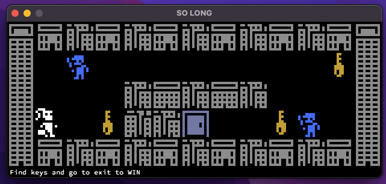

# Push Swap
This is SO_LONG 42's project.

### Goals of project

Create a simple game by using 42's miniLibx (X11).

### How to run

My project includes miniLibx for macOS.

1. Compile the project with `make bonus`.
2. You can use maps for game from 'map/' or create your own.
3. Run for example`./so_long_bonus maps/map_bonus.ber`.

#### Example
